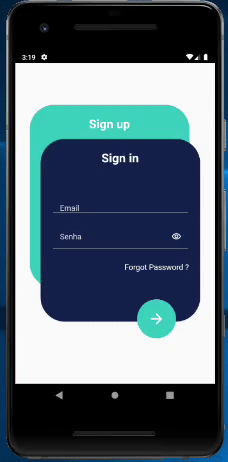
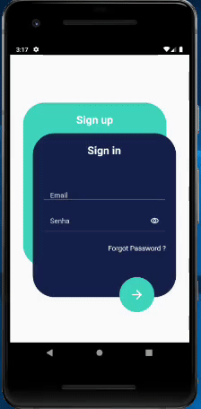

# Login Sample

A login page done during Raro Academy course, as the third assignment (LevelUP3)
## About the application

This project consists of a sign in page, sign up page and a forgot password page.

## Functionalities
- Sign in page text form field with validation

## Still not implemented
- Sign up page validation
- Forgot password screen and validation

## To Do
- [ ] Sign up page validation
- [ ] Forgot password page
- [ ] forgot password validation

## Extra Information

- The layout was done by [Karthick Krishnamoorthy](https://dribbble.com/karthickkrishna), and it's available at [Dribbble](https://dribbble.com/shots/6969883--001-Sign-up-form-DailyUI-challenge/attachments/6969883--001-Sign-up-form-DailyUI-challenge?mode=media)

